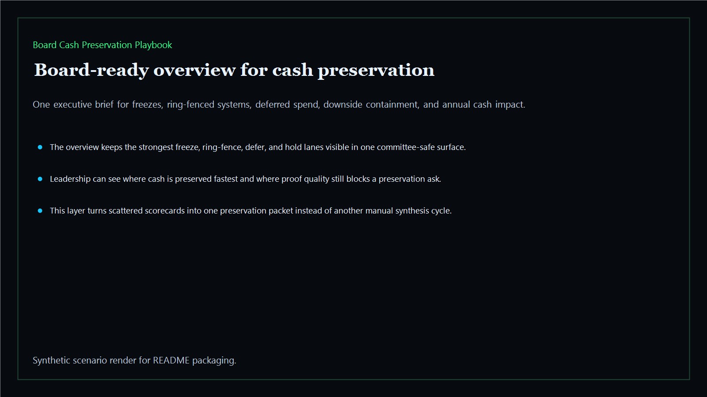
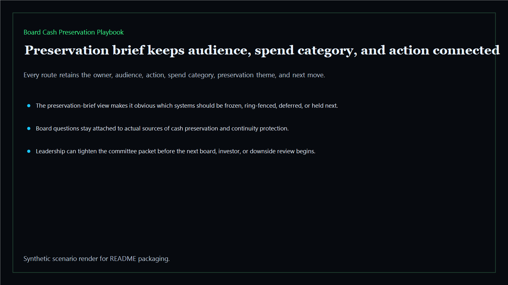
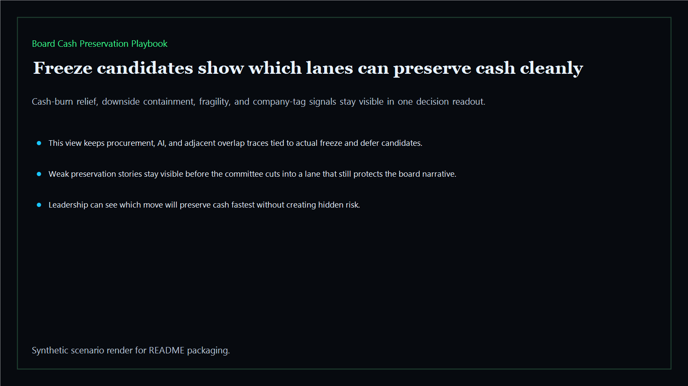
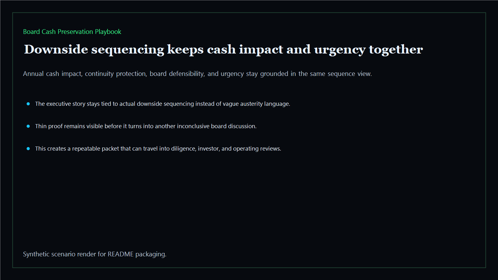

# Board Cash Preservation Playbook

Board-ready cash-preservation playbook for freezing spend, ring-fencing core systems, and sequencing downside containment across the executive estate.

- Live: `https://preserve.kineticgain.com/`
- Repo: `mizcausevic-dev/board-cash-preservation-playbook`

## Why this matters

Leaders need more than a generic budget cut list. They need one playbook that shows what should be frozen, what should be ring-fenced, where downside must be contained first, and which systems can absorb temporary pressure without damaging the board story.

## Product depth

- TypeScript executive-intelligence surface for freezing, ring-fencing, deferring, and holding spend with modeled cash-burn relief, downside containment, continuity protection, board defensibility, and urgency signals
- synthetic executive lanes across AI, identity, revenue, FinTech, biotech, procurement, and public-sector readiness
- reusable outputs for preservation briefs, freeze candidates, downside sequencing, and board-ready risk maps
- prerendered static site, JSON payloads, screenshots, and docs
- buyer-readable preservation story that helps leaders explain what gets cut, what stays protected, and what tradeoffs are acceptable
- technical proof that the same TypeScript model powers the CLI, JSON packet, static routes, screenshots, and verification notes

## What these repos have in common

This repo is part of the Kinetic Gain executive-intelligence pattern: every surface converts scattered operational facts into a board-readable packet with a clear risk signal, accountable owner context, reusable evidence, and a next action. The common thread is not just a dashboard; it is a decision system that can travel from operator review to executive memo without losing the proof.

## Operating workflow

1. Load the sample preservation lanes from `fixtures/`.
2. Score freeze, ring-fence, defer, and hold motions across cash relief, downside containment, continuity, board defensibility, and urgency.
3. Render the same packet as CLI output, JSON APIs, static HTML routes, and README screenshots.
4. Use the verification route to keep synthetic boundaries, reproducibility, and safe interpretation visible.

## Routes

- `/`
- `/preservation-brief`
- `/freeze-candidates`
- `/downside-sequencing`
- `/verification`
- `/docs`

## Local run

```bash
cd board-cash-preservation-playbook
npm install
npm run verify
npm run prerender
npm run render:assets
```

## CLI

```bash
npx board-cash-preservation-playbook fixtures/board-cash-preservation-playbook.json --format summary
npx board-cash-preservation-playbook fixtures/board-cash-preservation-playbook-clean.json --format json
```

## Docs

- [Architecture](docs/architecture.md)
- [Origin](docs/ORIGIN.md)
- [Kinetic Gain Embedded](docs/KINETIC_GAIN_EMBEDDED.md)

## Screenshots





